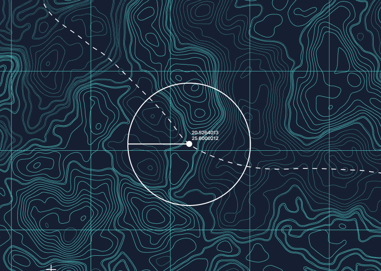

This repository contains a set of scripts and tools for running benchmarks on vanilla Redis GEO commands and RediSearch, a full-text search engine for Redis. 

The benchmarks in this repository cover a range of common Redis GEO and RediSearch operations, such as indexing, searching, and querying data. 

The results of the benchmarks can be used to compare the performance of different Redis configurations, to gain insights into the behavior of these tools,  and to identify potential bottlenecks or areas for optimization.


## Installation

### Download Standalone binaries ( no Golang needed )

If you don't have go on your machine and just want to use the produced binaries you can download the following prebuilt bins:

https://github.com/redis-performance/geo-bench/releases/latest

| OS | Arch | Link |
| :---         |     :---:      |          ---: |
| Linux   | amd64  (64-bit X86)     | [geo-bench-linux-amd64](https://github.com/redis-performance/geo-bench/releases/latest/download/geo-bench-linux-amd64.tar.gz)    |
| Linux   | arm64 (64-bit ARM)     | [geo-bench-linux-arm64](https://github.com/redis-performance/geo-bench/releases/latest/download/geo-bench-linux-arm64.tar.gz)    |
| Darwin   | amd64  (64-bit X86)     | [geo-bench-darwin-amd64](https://github.com/redis-performance/geo-bench/releases/latest/download/geo-bench-darwin-amd64.tar.gz)    |
| Darwin   | arm64 (64-bit ARM)     | [geo-bench-darwin-arm64](https://github.com/redis-performance/geo-bench/releases/latest/download/geo-bench-darwin-arm64.tar.gz)    |

Here's how bash script to download and try it:

```bash
wget -c https://github.com/redis-performance/geo-bench/releases/latest/download/geo-bench-$(uname -mrs | awk '{ print tolower($1) }')-$(dpkg --print-architecture).tar.gz -O - | tar -xz

# give it a try
./geo-bench --help
```

### Installation in a Golang env

The easiest way to get and install the benchmark utility with a Go Env is to use
`go get` and then `go install`:
```bash
# Fetch this repo
go get github.com/redis-performance/geo-bench
cd $GOPATH/src/github.com/redis-performance/geo-bench
make
```


## Try it out

### GeoPoints
```bash
# get dataset
wget https://s3.us-east-2.amazonaws.com/redis.benchmarks.spec/datasets/geopoint/documents.json.bz2
bzip2 -d documents.json.bz2

# get tool
wget -c https://github.com/redis-performance/geo-bench/releases/latest/download/geo-bench-$(uname -mrs | awk '{ print tolower($1) }')-$(dpkg --print-architecture).tar.gz -O - | tar -xz

# load data
./geo-bench load
```

### GeoPolygons

#### Load data in Redis
```bash
# get dataset ( around 30GB uncompressed )
wget https://s3.us-east-2.amazonaws.com/redis.benchmarks.spec/datasets/geoshape/polygons.json.bz2
bzip2 -d polygons.json.bz2

# get tool
wget -c https://github.com/redis-performance/geo-bench/releases/latest/download/geo-bench-$(uname -mrs | awk '{ print tolower($1) }')-$(dpkg --print-architecture).tar.gz -O - | tar -xz

# load 1st 1M polygons
./geo-bench load --input-type geoshape --input polygons.json -n 1000000 --db redisearch-hash
```

#### Query data in Redis

```bash
# load 1st 1M polygons
./geo-bench query --db redisearch-hash --input polygons.json -c 50 --input-type geoshape -n 10000 --query-type geoshape-within
```


#### Load data in ElasticSearch 
```bash
sudo sysctl -w vm.max_map_count=262144
docker run -p 9200:9200 -p 9300:9300 -e "ELASTIC_PASSWORD=password"  docker.elastic.co/elasticsearch/elasticsearch:8.7.1
./geo-bench load --db elasticsearch --input polygons.json -c 50 --input-type geoshape --es.password password --es.bulk.batch.size 100

# confirm you've got the expected doc count
$ curl -k --user "elastic:password" -X GET "https://localhost:9200/geo/_count?pretty" -H 'Content-Type: application/json'

# check the memory usage of that index
$ curl -k --user "elastic:password" -X GET "https://localhost:9200/geo/_stats?pretty" -H 'Content-Type: application/json'

```

#### Query data in ElasticSearch

```bash
# load 1st 1M polygons
./geo-bench query --db elasticsearch --input polygons.json -c 50 --input-type geoshape --es.password password -n 10000 --query-type geoshape-within
```


